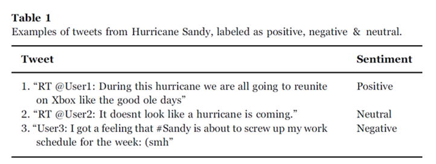

# Emergency-Viz
Emergency heatmap visualization based on social media sentiment analysis data

## [View Demo](https://lvrg12.github.io/Emergency-Viz)
## [Social Media Demo](https://ak65234.github.io/yint)

### [2019 VAST Challenge 3](https://vast-challenge.github.io/2019/MC3.html)
### [Project Plan Slides](https://docs.google.com/presentation/d/1NSMiZwhJRdERxvI1hofadxJo497KDrJnYWnUcZlnioE/edit?usp=sharing)

## VAST Mini-Challenge 3

Source: https://vast-challenge.github.io/2019/MC3.html

Seismic and survey data are useful for capturing the objective damage that the earthquake has caused St. Himark. However, this data has limitations. First, official surveys are time consuming and do not stay current in a rapidly changing situation. Second, they don’t establish how citizens are reacting to the current crisis. Third, they are often insufficiently granular, providing little insight into differences between neighborhoods. In other words, the seismic and survey data do not provide an up-to-date view of the structural and humanitarian impact caused by the earthquake on a neighborhood-by-neighborhood basis. The City has concluded that this knowledge is necessary to determine where to allocate emergency resources.

City Officials have identified a subset of Y*INT, a community-based social media platform, as a potential source for revealing the current state of St. Himark’s neighborhoods and people. Knowing that you are skilled in visual analytics, the City has asked you to analyze Y*INT messages in order to determine the appropriate actions it must take in order to assist the community in this disaster.

### Tasks

1. Using visual analytics, characterize conditions across the city and recommend how resources should be allocated at 5 hours and 30 hours after the earthquake. Include evidence from the data to support these recommendations. Consider how to allocate resources such as road crews, sewer repair crews, power, and rescue teams. Limit your response to 1000 words and 12 images.

2. Identify at least 3 times when conditions change in a way that warrants a re-allocation of city resources. What were the conditions before and after the inflection point? What locations were affected? Which resources are involved? Limit your response to 1000 words and 10 images.

3. Take the pulse of the community. How has the earthquake affect life in St. Himark? What is the community experiencing outside the realm of the first two questions? Show decision makers summary information and relevant/characteristic examples. Limit your response to 800 words and 8 images

4. The data for this challenge can be analyzed either as a static collection or as a dynamic stream of data, as it would occur in a real emergency. Describe how you analyzed the data - as a static collection or a stream. How do you think this choice affected your analysis? Limit your response to 200 words and 3 images.

## Solution

Our solution consists on implementing sentiment analysis on the earthquake-related messages to indentify the emergency level of the user and map them to specific needs (health, water, electricity). 

### Overview

The process to accomplish this is the following:

1. Preprocessing each message
    1. Tokenization
    2. Lemmatization
    3. Stemming
    4. Word correction
2. Sentiment analysis on each message
    1. Calculate the sentiment of each message using a pretrained sentiment analysis algorithm.
3. Categorization
    1. Categorization of each message using a set of keywords per resource category.
4. Time-series graph
5. Choropleth map
    1. A neighborhood level map is used to show their distinct values.
    2. A color gradient (red-green) is used to show average sentiment score.
    3. A color gradient (white-blue) is used to show the amount of messages posted
6. Detail message view
    1. A snapshot of the messages is used to show detail related messages

### Preprocessing
In order to accuretely analyze the messages posted by users they must have to be gramatically consistent. Hence, each word in each message is corrected and simplified. To do this, a series of word preprocessing techniques are implemented.

- Tokenization
    - Each message is separated by punctuations and empty spaces.
    - This allows each word to be processed individually in the following steps.
- Lemmatization
    - Each word is transformed to its simplest (base) form.
    - By reverting past tenses, plurals, adjectives, and other complex forms, each word is more likely to be accurately analyzed.
- Stemming
    - Each word is again transformed to its base form often chopping off a part of the word.
    - Lemmatization is not always able to transform the word to a base form hence this robust technique is used.
- Word correction
    - The sentence is put back together and its grammar is corrected using a grammar library.
    - This is necessary since many words are potentially incomplete due to stemming.

At the end of these processes, each simplified message is ready to be analyzed.

All the preprocessing techniques were implemented in Python using the NLTK library [2]. These changes to the data were also done prior to loading the data to the web in order to avoid heavy browser computation and to take advantage of the Python environment and libraries.

### Sentiment Analysis
There have been multiple studies that have shown that using sentiment analysis of social media posts, along with a robust classifier, is able to predict the emergency level of individuals during a natual disaster [3,4,5]. With that in mind, we chose to implement a similar approach in determining the emergency level of the users in our ficticious town. Due to time and expertise constraints a classifier was not implemented as suggested by Neppalli et al [5]. Nevertheless, a sentiment analysis calculation was performed on each message and its score was appended to the original data csv file. The score can be anywhere from -1 to 1; where -1 is negative, 0 is neutral, and 1 is positive. An example of such analysis is pictured in the following figure.

 [5]

Sentiment analysis was also performed prior to loading the data to the web. It was implemented using Python by the TextBlob library [6].

### Categorization
Since there are many messages that are not related to the natural disaster a keyword filtering was added to not only filter out the irrelevant messages but also categorize the type of message posted. This naive yet effective method was previously used by Rexiline Raginia et al. [3] and Wu [4] to categorize the type of messages. Therefore, we included the set of keyword they used plus the ones that we thought appropriate.

The following are the categories and the keywords used:

| Category | Keywords |
| --- | --- |
| Water | water, flood, flooding, sewer, drink, thirst, dehydration |
| Electricity | power, electric, light, energy, current, charge |
| Food | food, starve, eat, eating, hungry, milk, bread, formula, foodstuff |
| Electricity | health, hurt, pain, help, SOS, breading, blood, arm, leg, death unconsious, hospital, fire, firegfighter, care, medicine, nurse, first aid, clinic, doctor |
| Earthquake | shake, shaking, vibrate, earthquake, quake, trembling |

It must be noted that this method still has a margin of error.

Once again, this phase was implemented in Python and the results were appended to the csv file.

### Time-series graph

### Choropleth Map

### Detail message view

## Task Specific Solutions

1. Allocation of resources based on time and conditions.

Utilizing the time slider, the choropleth map can be set to show the average sentiment analysis of each neighborhood during a specific interval. The picture below shows the time range between the time the incident first started (that time is set manually based on the official city report) and 5 and half hours after that. The negative sentiment score average shows the areas where the users show the most negative messages and presumably the ones that need urgent assistance.

2. Relocation of resources and change in conditions.

3. Overall sentiment in St. Himark and extra information shown.

4. Static collection analysis.

## Contributions

## References

1. D3, https://d3js.org
2. NLTK, https://www.nltk.org/
3. “Big data analytics for disaster response and recovery through sentiment Analysis” by J. Rexiline Raginia, P.M. Rubesh Anand, Vidhyacharan Bhaskar
4. “Disaster early warning and damage assessment analysis using social media data and geo-location information” by Desheng Wu, Yiwen Cui
5. “Sentiment analysis during Hurricane Sandy in emergency response” by Venkata K. Neppalli, Cornelia Caragea, Anna Squicciarini, Andrea Tapia, Sam Stehle
6. TextBlob, https://textblob.readthedocs.io/en/dev/index.html
7. Time-series library
8. Doug Dowson, http://bl.ocks.org/dougdowson/9832019
9. jQuery, https://jquery.com/